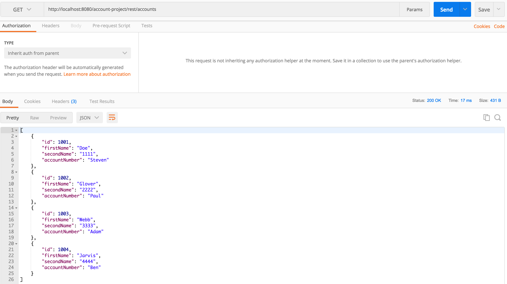
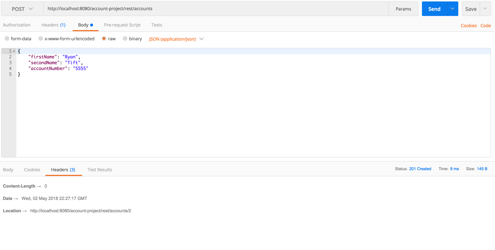
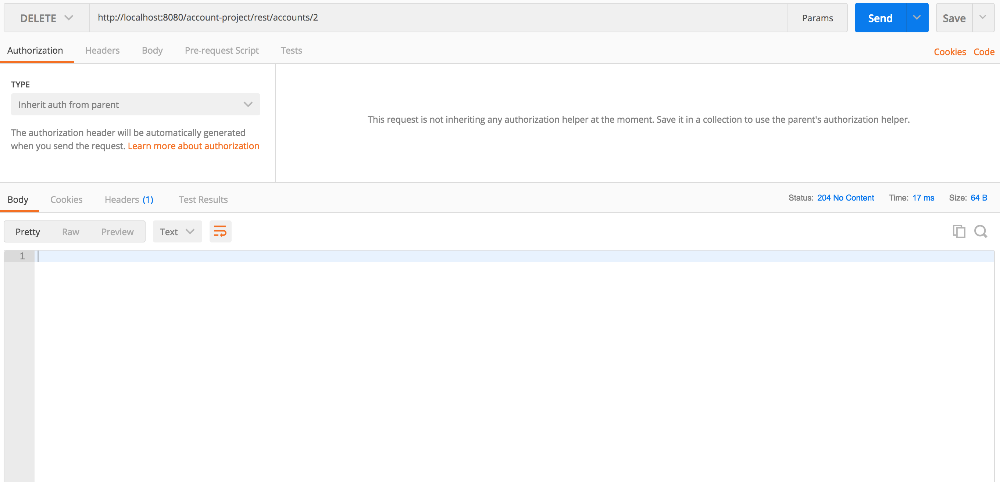

# account-project

Simple account RESTful API that provides a user with a CRUD service for managing simple accounts

## Swagger UI

See swagger api for documentation (http://localhost:8080/account-project/swagger-ui.html#/)

## Deployment

Checkout the code and build it with maven using :

    clean package

To run the app :

    mvn spring-boot:run
    
To test REST API:
    
    Use postman

